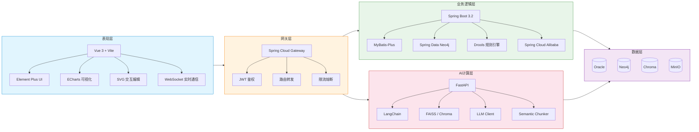
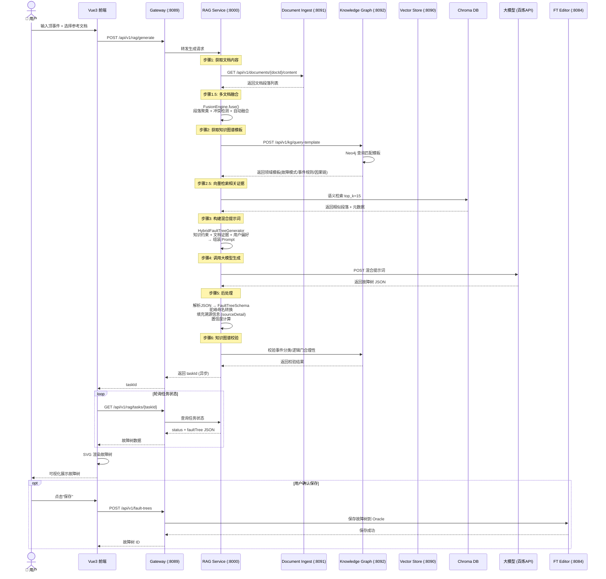
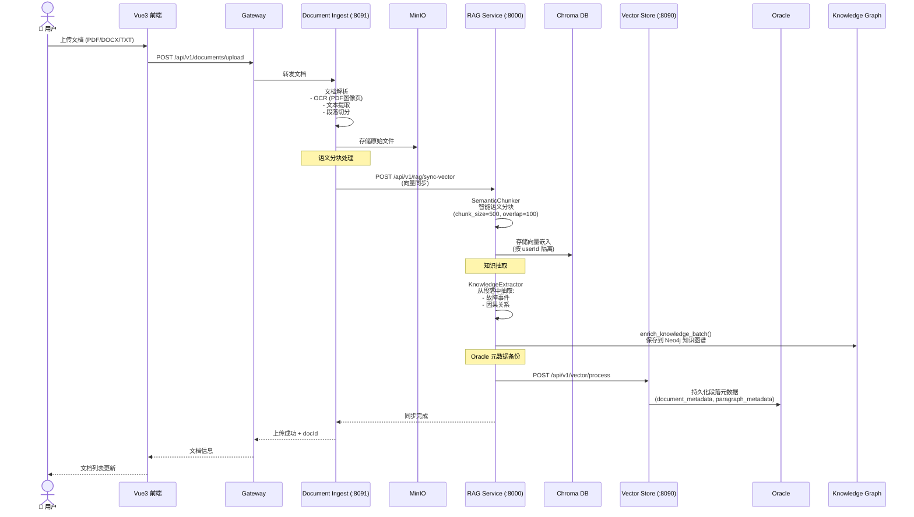
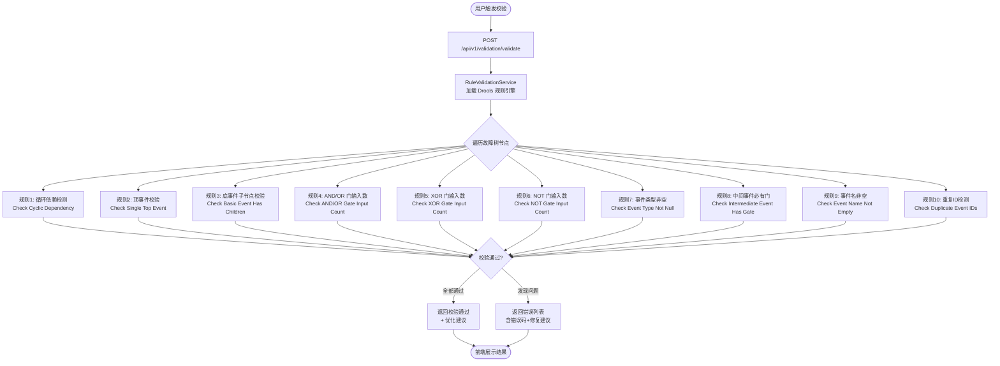
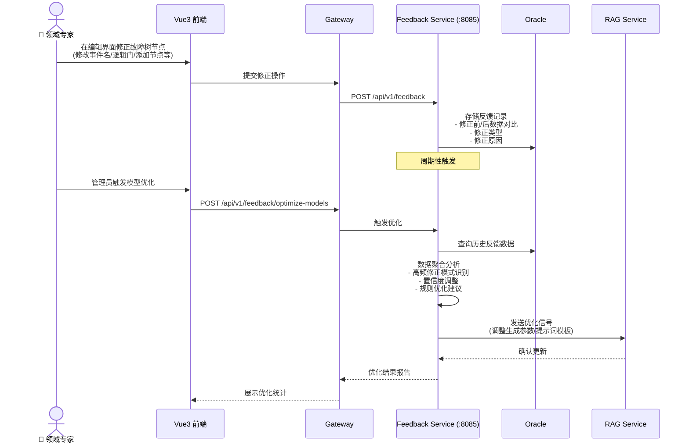
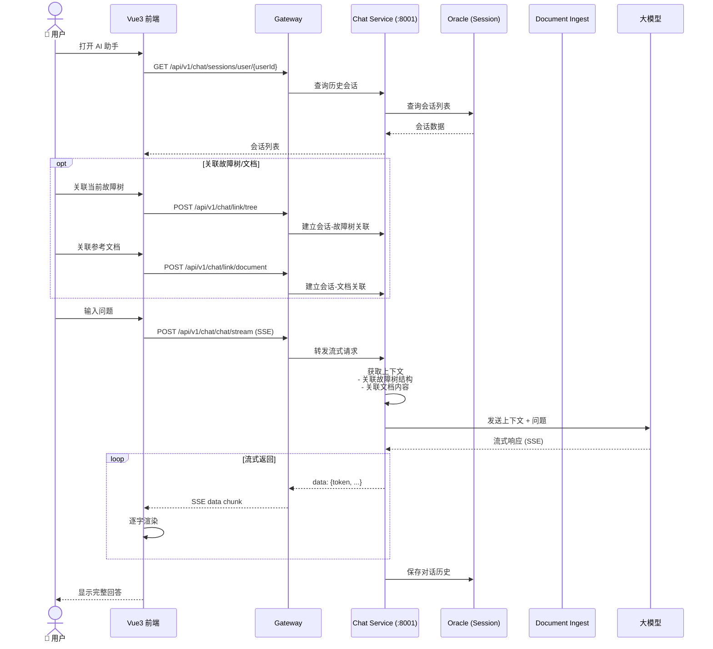

# 基于知识的工业设备故障树智能生成与辅助构建系统

## 目录

- [项目概述](#项目概述)
- [系统架构](#系统架构)
  - [整体架构图](#整体架构图)
  - [技术架构分层](#技术架构分层)
  - [微服务交互关系](#微服务交互关系)
- [核心功能](#核心功能)
  - [功能总览](#功能总览)
  - [故障树AI生成流程](#故障树ai生成流程)
  - [文档摄入与向量同步流程](#文档摄入与向量同步流程)
  - [规则校验流程](#规则校验流程)
  - [专家反馈学习流程](#专家反馈学习流程)
  - [AI助手对话流程](#ai助手对话流程)
- [技术栈](#技术栈)
- [项目结构](#项目结构)
- [快速开始](#快速开始)
  - [Docker Compose 一键部署](#docker-compose-一键部署)
  - [本地开发部署](#本地开发部署)
- [API接口说明](#api接口说明)
- [配置说明](#配置说明)
- [开发指南](#开发指南)
- [故障排除](#故障排除)
- [许可证](#许可证)

---

## 项目概述

本项目是一套面向高端制造运维场景的 **"基于知识的工业设备故障树智能生成与辅助构建系统"**。系统通过深度融合大语言模型（LLM）、知识图谱（Knowledge Graph）、RAG（检索增强生成）与 Drools 规则引擎，实现了从非结构化工业文档（设备手册、维修日志、技术报告等）中自动抽取故障逻辑、生成符合 FTA（Fault Tree Analysis）标准的故障树，并支持领域专家通过可视化界面进行交互式校验与修正。

### 核心设计理念

| 理念 | 说明 |
|------|------|
| **知识驱动 + 数据驱动** | 融合领域知识图谱的结构化约束与向量检索的文档证据，生成高质量故障树 |
| **人机协同** | AI 自动生成初稿，专家可视化校验修正，形成持续优化的闭环 |
| **溯源可解释** | 每个故障事件节点均附带文档溯源证据，确保生成结果可追溯、可验证 |
| **微服务解耦** | 各功能模块独立部署，通过 RabbitMQ 异步解耦，保证高内聚低耦合 |

---

## 系统架构

### 整体架构图

系统采用 **Spring Cloud 微服务 + Vue3 前端 + Python AI 服务** 的三层架构，底层基础设施涵盖 Oracle、Neo4j、RabbitMQ、MinIO 和 Chroma 向量数据库。

```mermaid
graph TB
    subgraph 用户层["👤 用户层"]
        Browser["浏览器 (Vue3 + Element Plus)"]
    end

    subgraph 网关层["🚪 网关层 (:8089)"]
        Gateway["Gateway Service<br/>Spring Cloud Gateway<br/>统一鉴权 / 路由转发 / 限流"]
    end

    subgraph 业务服务层["📦 Java 业务服务层 (Spring Boot 3.2 + Spring Cloud Alibaba)"]
        Auth["Auth Service<br/>(:8086)<br/>用户认证 / JWT签发"]
        DocIngest["Document Ingest Service<br/>(:8091)<br/>文档上传 / 解析 / OCR"]
        KG["Knowledge Graph Service<br/>(:8092)<br/>Neo4j图谱构建与查询"]
        RuleValidation["Rule Validation Service<br/>(:8093)<br/>Drools规则引擎校验"]
        FTEditor["Fault Tree Editor Service<br/>(:8084)<br/>故障树CRUD / 版本管理 / 协作"]
        Feedback["Feedback Learning Service<br/>(:8085)<br/>专家反馈收集 / 模型优化触发"]
        VectorStore["Vector Store Service<br/>(:8090)<br/>向量元数据管理 / Oracle持久化"]
        LogService["Log Service<br/>(:8095)<br/>操作日志记录与审计"]
    end

    subgraph AI服务层["🤖 Python AI 服务层 (FastAPI + LangChain)"]
        RAG["RAG Generation Service<br/>(:8000)<br/>故障树生成 / 知识抽取 / 向量同步"]
        Chat["Chat Service<br/>(:8001)<br/>AI对话 / 流式响应"]
        Classification["Classification Service<br/>(:8002)<br/>文档分类"]
        Fusion["Fusion Service<br/>(:8003)<br/>多文档融合 / 冲突检测"]
        Evaluation["Evaluation Service<br/>(:8004)<br/>故障树质量评估"]
    end

    subgraph 基础设施层["🗄️ 基础设施层"]
        Oracle[("Oracle XE<br/>(:1521)<br/>业务数据存储")]
        Neo4j[("Neo4j<br/>(:7474/:7687)<br/>知识图谱存储")]
        RabbitMQ[("RabbitMQ<br/>(:5672/:15672)<br/>消息队列")]
        MinIO[("MinIO<br/>(:9000/:9001)<br/>对象存储")]
        Chroma[("Chroma DB<br/>向量存储与检索")]
        Nacos[("Nacos<br/>(:8848)<br/>配置中心 / 服务发现")]
    end

    Browser -->|"HTTP/REST"| Gateway
    Gateway -->|"路由转发"| Auth
    Gateway -->|"路由转发"| DocIngest
    Gateway -->|"路由转发"| KG
    Gateway -->|"路由转发"| RuleValidation
    Gateway -->|"路由转发"| FTEditor
    Gateway -->|"路由转发"| Feedback
    Gateway -->|"路由转发"| VectorStore
    Gateway -->|"路由转发"| LogService
    Gateway -->|"路由转发"| RAG
    Gateway -->|"路由转发"| Chat

    DocIngest -->|"异步消息"| RabbitMQ
    RAG -->|"异步消息"| RabbitMQ
    FTEditor -->|"异步消息"| RabbitMQ
    Feedback -->|"异步消息"| RabbitMQ

    Auth --> Oracle
    FTEditor --> Oracle
    Feedback --> Oracle
    VectorStore --> Oracle
    LogService --> Oracle
    KG --> Neo4j
    RAG --> Chroma
    RAG --> KG
    DocIngest --> MinIO
    RAG --> MinIO

    RAG -->|"Feign/HTTP调用"| DocIngest
    RAG -->|"HTTP调用"| VectorStore
    RAG -->|"HTTP调用"| KG

    Auth -.->|"服务注册/配置"| Nacos
    DocIngest -.->|"服务注册/配置"| Nacos
    KG -.->|"服务注册/配置"| Nacos
    RuleValidation -.->|"服务注册/配置"| Nacos
    FTEditor -.->|"服务注册/配置"| Nacos
    Feedback -.->|"服务注册/配置"| Nacos
    VectorStore -.->|"服务注册/配置"| Nacos
    LogService -.->|"服务注册/配置"| Nacos
    Gateway -.->|"服务注册/配置"| Nacos

    style 用户层 fill:#e1f5fe,stroke:#0288d1
    style 网关层 fill:#fff3e0,stroke:#f57c00
    style 业务服务层 fill:#e8f5e9,stroke:#388e3c
    style AI服务层 fill:#fce4ec,stroke:#c62828
    style 基础设施层 fill:#f3e5f5,stroke:#7b1fa2
```



### 技术架构分层



### 微服务交互关系

各服务之间主要通过以下三种方式通信：

| 通信方式 | 适用场景 | 示例 |
|---------|---------|------|
| **RabbitMQ 异步消息** | 长耗时任务、跨服务事件通知 | 文档解析完成 → 通知向量同步 / 知识抽取 |
| **Feign / HTTP 同步调用** | 实时数据查询、服务间直接依赖 | RAG 服务查询文档内容 → 调用 Document Ingest Service |
| **Nacos 服务发现** | 动态服务注册与发现 | Gateway 通过 Nacos 发现所有后端服务实例 |

---

## 核心功能

### 功能总览

| 功能模块 | 说明 | 涉及服务 |
|---------|------|---------|
| **故障树 AI 智能生成** | 基于上传文档 + 知识图谱模板，通过 RAG + LLM 自动生成符合 FTA 标准的故障树 | RAG Service, KG Service, Vector Store |
| **可视化编辑与校验** | 提供 SVG 图形化拖拽编辑界面，支持节点增删、逻辑门修改、位置调整等操作 | FT Editor Service, Rule Validation Service |
| **知识图谱管理** | 基于 Neo4j 构建 ISO 13379 标准故障本体，预加载事件模板，支持动态扩展 | KG Service |
| **文档处理与融合** | 支持 PDF/DOCX/TXT 格式文档上传，执行 OCR、语义分块、元数据提取、多文档融合 | Document Ingest Service, Fusion Service |
| **规则引擎校验** | 基于 Drools 的故障树逻辑合规校验（循环依赖检测、逻辑门输入数校验、事件类型校验等） | Rule Validation Service |
| **反馈学习闭环** | 收集专家修正操作反馈，周期性触发 AI 模型优化 | Feedback Learning Service |
| **AI 智能助手** | 支持流式对话交互，可关联故障树和文档进行上下文问答 | Chat Service |
| **用户认证与审计** | JWT 认证授权，用户隔离，全链路操作日志审计 | Auth Service, Log Service |

### 故障树AI生成流程

这是系统最核心的功能流程，展示了从用户输入顶事件到生成完整故障树的完整数据流：



#### 混合生成策略

生成器支持两种模式：

| 模式 | 说明 | 适用场景 |
|------|------|---------|
| **single_pass**（默认） | 单次调用 LLM 生成完整故障树 | 中小规模故障树（<50 个节点） |
| **recursive** | 递归分批次生成，逐层分解中间事件 | 复杂大规模故障树（>50 个节点） |

### 文档摄入与向量同步流程



### 规则校验流程

系统通过 **Drools 规则引擎** 对故障树进行结构化校验，确保逻辑合规：



#### Drools 规则说明

| 规则 | 错误码 | 检测内容 |
|------|-------|---------|
| Check Cyclic Dependency | `CYCLE_DETECTED` | 故障树是否存在循环引用（如 A→B→A） |
| Check Single Top Event | `MULTIPLE_TOP_EVENTS` | 根节点必须是 TOP 类型事件 |
| Check Basic Event Has Children | `BASIC_EVENT_HAS_CHILDREN` | 底事件不能有子节点 |
| Check AND/OR Gate Input Count | `INSUFFICIENT_INPUTS` | AND/OR 门至少需要 2 个输入 |
| Check XOR Gate Input Count | `INSUFFICIENT_XOR_INPUTS` | XOR 门至少需要 2 个互斥输入 |
| Check NOT Gate Input Count | `INVALID_NOT_GATE_INPUTS` | NOT 门必须有且仅有 1 个输入 |
| Check Event Type Not Null | `MISSING_EVENT_TYPE` | 每个节点必须有事件类型 |
| Check Intermediate Event Has Gate | `MISSING_GATE_TYPE` | 有子节点的中间事件必须指定逻辑门 |
| Check Event Name Not Empty | `EMPTY_EVENT_NAME` | 事件名称不能为空 |
| Check Duplicate Event IDs | `DUPLICATE_EVENT_ID` | 事件 ID 必须全局唯一 |

### 专家反馈学习流程



### AI助手对话流程



---

## 技术栈

### 后端（Java）

| 技术 | 版本 | 用途 |
|------|------|------|
| Java | 17 | 运行环境 |
| Spring Boot | 3.2.0 | 应用框架 |
| Spring Cloud | 2023.0.0 | 微服务治理 |
| Spring Cloud Alibaba | 2023.0.3.4 | Nacos 集成 |
| Spring Cloud Gateway | - | API 网关 |
| Spring Data Neo4j | - | 图数据库操作 |
| MyBatis-Plus | - | ORM 框架 |
| Drools | - | 规则引擎 |
| Oracle JDBC | - | 数据库驱动 |
| RabbitMQ | 3.12 | 消息队列 |
| Lombok | - | 代码简化 |

### 前端

| 技术 | 用途 |
|------|------|
| Vue 3 (Composition API) | 前端框架 |
| Vite | 构建工具 |
| Element Plus | UI 组件库 |
| ECharts | 数据可视化 |
| SVG (原生) | 故障树交互式绘制 |
| Axios | HTTP 客户端 |
| Fetch API (SSE) | AI 助手流式响应 |
| WebSocket | 实时协作通信 |

### AI 服务（Python）

| 技术 | 用途 |
|------|------|
| Python 3.10+ | 运行环境 |
| FastAPI + Uvicorn | API 服务框架 |
| LangChain | LLM 应用编排 |
| FAISS / Chroma | 向量存储与检索 |
| Pydantic | 数据模型校验 |
| NumPy | 向量计算 |
| python-dotenv | 环境变量管理 |

### 基础设施

| 技术 | 版本 | 用途 |
|------|------|------|
| Oracle XE | 18.4.0 | 关系型数据库 |
| Neo4j | 4.4.17 | 图数据库（知识图谱） |
| RabbitMQ | 3.12-management | 消息队列 |
| MinIO | latest | 对象存储 |
| Chroma | - | 向量数据库 |
| Nacos | 2.2.3 | 配置中心 / 服务发现 |
| Docker + Compose | 20.10+ | 容器化部署 |

---

## 项目结构

```
Fault_Tree_Assistant/
│
├── backend/                              # Java 后端微服务 (Spring Boot 3.2)
│   ├── pom.xml                           #   父 POM，统一依赖管理
│   ├── common-core/                      #   🔧 共享核心库 (DTO/Enum/Utils)
│   ├── gateway-service/                  #   🚪 API 网关 (:8089)
│   │   └── src/main/java/.../gateway/    #      路由配置 / JWT 鉴权 / 限流
│   ├── auth-service/                     #   🔐 认证服务 (:8086)
│   │   └── src/main/java/.../auth/       #      登录注册 / JWT 签发 / 用户管理
│   ├── document-ingest-service/          #   📄 文档摄入服务 (:8091)
│   │   └── src/main/java/.../document/   #      文档上传解析 / OCR / 段落切分
│   ├── knowledge-graph-service/          #   🧠 知识图谱服务 (:8092)
│   │   └── src/main/java/.../knowledge/  #      Neo4j 图谱 CRUD / ISO 13379 模板
│   ├── rule-validation-service/          #   ✅ 规则校验服务 (:8093)
│   │   ├── src/main/java/.../validation/ #      Drools 引擎 / 校验控制器
│   │   └── src/main/resources/rules/     #      fault-tree-validation.drl (10条规则)
│   ├── fault-tree-editor-service/        #   🌳 故障树编辑服务 (:8084)
│   │   ├── src/main/java/.../editor/     #      故障树 CRUD / 版本管理 / 协作状态
│   │   └── src/main/resources/mapper/    #      MyBatis XML 映射
│   ├── feedback-learning-service/        #   🔄 反馈学习服务 (:8085)
│   │   └── src/main/java/.../feedback/   #      反馈收集 / 聚合分析 / 模型优化触发
│   ├── vector-store-service/             #   📊 向量存储服务 (:8090)
│   │   └── src/main/java/.../vector/     #      向量元数据管理 / Oracle 持久化
│   ├── log-service/                      #   📝 日志服务 (:8095)
│   │   └── src/main/java/.../log/        #      操作日志记录 / 审计查询
│   └── Dockerfile.*                      #   各服务 Docker 构建文件
│
├── frontend/                             # 🖥️ Vue3 前端
│   ├── src/
│   │   ├── views/                        #   页面视图
│   │   │   ├── Home.vue                  #      首页（系统概览 + 统计）
│   │   │   ├── Login.vue                 #      登录注册
│   │   │   ├── FaultTree.vue             #      故障树列表管理
│   │   │   ├── FaultTreeEdit.vue         #      故障树编辑器（核心页面）
│   │   │   ├── Document.vue              #      文档上传与管理
│   │   │   ├── KnowledgeGraph.vue        #      知识图谱可视化（ECharts）
│   │   │   ├── AIAssistant.vue           #      AI 对话助手（流式响应）
│   │   │   └── Feedback.vue              #      反馈管理
│   │   ├── components/                   #   可复用组件
│   │   │   ├── SVGFaultTree.vue          #      SVG 故障树绘制引擎（核心组件）
│   │   │   ├── FaultTreeChart.vue        #      ECharts 故障树图表
│   │   │   ├── NodeEditorDialog.vue      #      节点编辑弹窗
│   │   │   ├── SourceDetail.vue          #      溯源详情面板
│   │   │   └── ValidationResult.vue      #      校验结果展示
│   │   ├── api/index.js                  #   API 接口封装（全模块）
│   │   ├── router/index.js               #   路由配置 + 权限守卫
│   │   ├── App.vue                       #   根组件
│   │   └── main.js                       #   应用入口
│   ├── svg/                              #   SVG 逻辑门图标
│   ├── index.html
│   ├── vite.config.js
│   └── Dockerfile
│
├── python-service/                       # 🤖 Python AI 服务集群
│   ├── main.py                           #   服务集群统一启动入口
│   ├── requirements.txt                  #   Python 依赖
│   │
│   ├── rag_generation_service/           #   ⭐ RAG 生成服务 (:8000)
│   │   ├── rag_api.py                    #      FastAPI 主入口（故障树生成/向量同步）
│   │   ├── rag_mq_service.py             #      RabbitMQ 消息消费
│   │   ├── rag_service/                  #      RAG 核心逻辑
│   │   │   ├── hybrid_generator.py       #        知识+数据混合生成器
│   │   │   ├── fault_tree_generator.py   #        故障树解析与构造
│   │   │   ├── recursive_generator.py    #        递归分批次生成器
│   │   │   ├── llm_client.py             #        大模型 API 客户端（百炼）
│   │   │   ├── vector_retriever.py       #        向量检索器
│   │   │   ├── vector_store.py           #        向量库后端管理（Chroma）
│   │   │   ├── knowledge_extractor.py    #        知识抽取器
│   │   │   ├── knowledge_graph_client.py #        图谱客户端
│   │   │   └── semantic_chunker.py       #        语义分块器
│   │   ├── Dockerfile
│   │   └── requirements.txt
│   │
│   ├── chat_service/                     #   💬 AI 对话服务 (:8001)
│   │   ├── chat_api.py                   #      对话 API（SSE 流式）
│   │   ├── llm_client.py                 #      LLM 客户端
│   │   ├── session_repository.py         #      会话持久化
│   │   └── db_utils.py                   #      数据库工具
│   │
│   ├── classification_service/           #   🏷️ 文档分类服务 (:8002)
│   │   └── classification_api.py
│   │
│   ├── fusion_service/                   #   🔗 数据融合服务 (:8003)
│   │   └── fusion_api.py
│   │
│   ├── evaluation_service/               #   📏 质量评估服务 (:8004)
│   │   └── evaluation_api.py
│   │
│   └── industrial_fta_common/            #   📚 Python 共享库
│       ├── prompts/                      #      提示词模板库
│       │   ├── prompt_loader.py          #        统一 Prompt 加载器
│       │   ├── fault_tree_generation.py  #        故障树生成模板
│       │   ├── event_type_rules.py       #        事件类型规则
│       │   ├── basic_event_keywords.py   #        底事件关键词库
│       │   ├── logic_gate_rules.py       #        逻辑门规则
│       │   ├── fewshot_examples.py       #        Few-shot 示例
│       │   └── ...
│       ├── fusion/                       #      融合引擎
│       │   ├── fusion_engine.py          #        核心融合引擎
│       │   ├── paragraph_cluster.py      #        段落聚类
│       │   ├── conflict_detector.py      #        冲突检测
│       │   └── document_classifier.py    #        文档分类
│       ├── evaluation/                   #      评估模块
│       │   ├── fault_tree_evaluator.py   #        故障树质量评估
│       │   └── gold_standard.py          #        Gold Standard
│       └── fault_tree_schema.py          #      故障树 Pydantic 数据模型
│
├── sql/                                  # 🗃️ 数据库初始化脚本
│   ├── sql_new.sql                       #   Oracle 表结构
│   └── neo4j_init_extended.cypher        #   Neo4j 知识图谱初始化
│
├── image/                                # 🖼️ 架构图/流程图资源
│   └── ...
│
├── docker-compose.yml                    # 🐳 Docker Compose 编排文件
├── .env.example                          #   环境变量示例
├── DEPLOYMENT.md                         #   详细部署指南
└── README.md                             #   本文档
```

---

## 快速开始

### Docker Compose 一键部署

> 完整的部署指南请查看 [DEPLOYMENT.md](./DEPLOYMENT.md)

#### 环境要求

| 资源 | 推荐配置 | 最小配置 |
|------|----------|----------|
| CPU | 8 核 | 4 核 |
| 内存 | 16GB+ | 8GB |
| 存储 | 50GB+ | 20GB |
| Docker | 20.10+ | 20.10+ |
| Docker Compose | 2.0+ | 2.0+ |

#### 部署步骤

```bash
# 1. 进入项目根目录
cd Fault_Tree_Assistant

# 2. 配置环境变量
cp .env.example .env
# 编辑 .env 文件，必须配置 AI API 密钥：
#   BAILIAN_API_KEY=your_actual_api_key

# 3. 启动所有服务（首次需构建镜像，约 5-10 分钟）
docker-compose up -d --build

# 4. 查看服务状态
docker-compose ps

# 5. 查看日志（可按服务名过滤）
docker-compose logs -f
docker-compose logs -f rag-generation-service
```

#### 服务访问地址

| 服务 | 地址 | 默认凭据 |
|-----|------|---------|
| **前端界面** | http://localhost:3000 | - |
| **API 网关** | http://localhost:8089 | - |
| **Nacos 控制台** | http://localhost:8848/nacos | nacos / nacos |
| **RabbitMQ 管理** | http://localhost:15672 | guest / guest |
| **Neo4j 浏览器** | http://localhost:7474 | neo4j / password |
| **MinIO 控制台** | http://localhost:9001 | minioadmin / minioadmin |

#### 后端服务 API

| 服务 | 端口 | API 路径 | 说明 |
|-----|------|---------|------|
| Auth Service | 8086 | `/api/v1/auth` | 用户认证 |
| Document Ingest | 8091 | `/api/v1/documents` | 文档管理 |
| Knowledge Graph | 8092 | `/api/v1/kg` | 知识图谱 |
| Rule Validation | 8093 | `/api/v1/validation` | 规则校验 |
| Fault Tree Editor | 8084 | `/api/v1/fault-trees` | 故障树 CRUD |
| Feedback Learning | 8085 | `/api/v1/feedback` | 反馈学习 |
| Vector Store | 8090 | `/api/v1/vector` | 向量元数据 |
| RAG Generation | 8000 | `/api/v1/rag` | AI 故障树生成 |
| Chat Service | 8001 | `/api/v1/chat` | AI 对话助手 |
| Log Service | 8095 | `/api/v1/logs` | 审计日志 |

#### 常用运维命令

```bash
# 停止所有服务（保留数据卷）
docker-compose down

# 停止并清除数据
docker-compose down -v

# 重启特定服务
docker-compose restart rag-generation-service

# 查看服务资源占用
docker stats

# 进入容器调试
docker exec -it fta-rag-generation-service bash
docker exec -it fta-gateway-service sh
```

### 本地开发部署

#### Java 后端

```bash
cd backend
./mvnw clean package -DskipTests
java -jar gateway-service/target/gateway-service-1.0.0.jar
# ... 依次启动其他服务
```

#### Vue3 前端

```bash
cd frontend
npm install
npm run dev
# 开发服务器默认 http://localhost:5173
```

#### Python AI 服务

```bash
cd python-service
pip install -r requirements.txt
pip install -e ./industrial_fta_common
cd rag_generation_service
pip install -r requirements.txt

# 启动单个服务
python rag_api.py            # RAG 生成服务 (:8000)

# 或启动全部服务集群
cd ..
python main.py               # 启动全部 5 个 Python 服务
```

---

## API 接口说明

### 前端 API 模块一览

| API 模块 | 主要接口 | 说明 |
|---------|---------|------|
| `authAPI` | `login`, `register` | 用户认证 |
| `documentAPI` | `upload`, `getDocumentList`, `deleteDocument` | 文档管理 |
| `faultTreeAPI` | `getAll`, `getById`, `create`, `update`, `delete`, `addNode`, `updateNode`, `deleteNode`, `moveNode` | 故障树 CRUD + 节点操作 |
| `validationAPI` | `validate` | 故障树逻辑校验 |
| `ragAPI` | `generate`, `getTaskStatus`, `getEvidence`, `getParagraphWithContext` | AI 故障树生成与溯源 |
| `chatAPI` | `createSession`, `chat`, `chatStream`, `linkTree`, `linkDocument` | AI 对话（含流式 SSE） |
| `knowledgeGraphAPI` | `getData`, `queryTemplate`, `enrich`, `initialize` | 知识图谱管理 |
| `vectorAPI` | `search`, `searchWithEvidence` | 向量检索 |
| `feedbackAPI` | `create`, `getAll`, `processBatch`, `optimizeModels` | 反馈管理 |
| `statsAPI` | `getDashboardStats` | 仪表盘统计 |

---

## 配置说明

### 关键环境变量

| 变量名 | 说明 | 默认值 | 必填 |
|--------|------|--------|------|
| `BAILIAN_API_KEY` | 阿里云百炼 API Key | - | ✅ |
| `BAILIAN_API_URL` | 百炼 API 地址 | - | ✅ |
| `LLM_MODEL` | 大模型名称 | `qwen-max` | - |
| `LLM_TEMPERATURE` | 生成温度 (0-1) | `0.7` | - |
| `LLM_MAX_TOKENS` | 最大 Token 数 | `8192` | - |
| `ORACLE_PASSWORD` | Oracle 密码 | `123456` | 🔒生产必改 |
| `NEO4J_PASSWORD` | Neo4j 密码 | `password` | 🔒生产必改 |
| `JWT_SECRET` | JWT 签名密钥 | - | 🔒生产必改 |
| `VECTOR_BACKEND` | 向量后端 (`chroma`) | `chroma` | - |
| `SIMILARITY_THRESHOLD` | 相似度阈值 | `0.7` | - |
| `CHUNK_SIZE` | 语义分块大小 | `500` | - |
| `CHUNK_OVERLAP` | 分块重叠大小 | `100` | - |

### Docker Compose 端口映射

| 服务 | 容器端口 | 主机端口 | 协议 |
|------|---------|---------|------|
| frontend | 80 | 3000 | HTTP |
| gateway-service | 8089 | 8089 | HTTP |
| auth-service | 8086 | 8086 | HTTP |
| document-ingest-service | 8091 | 8091 | HTTP |
| knowledge-graph-service | 8092 | 8092 | HTTP |
| rule-validation-service | 8093 | 8093 | HTTP |
| fault-tree-editor-service | 8084 | 8084 | HTTP |
| feedback-learning-service | 8085 | 8085 | HTTP |
| vector-store-service | 8090 | 8090 | HTTP |
| log-service | 8095 | 8095 | HTTP |
| rag-generation-service | 8000 | 8000 | HTTP |
| rabbitmq | 5672/15672 | 5672/15672 | AMQP/HTTP |
| oracle | 1521 | 1521 | TCP |
| neo4j | 7474/7687 | 7474/7687 | HTTP/Bolt |
| nacos | 8848/9848 | 8848/9848 | HTTP/gRPC |

---

## 开发指南

### 后端开发

1. 进入 `backend` 目录
2. 运行 `./mvnw clean package` 构建所有服务
3. 运行 `java -jar <service>/target/<service>-1.0.0.jar` 启动单个服务
4. 各服务通过 `application.yml` 配置数据源、消息队列等

### 前端开发

1. 进入 `frontend` 目录
2. 运行 `npm install` 安装依赖
3. 运行 `npm run dev` 启动开发服务器
4. 修改 `vite.config.js` 中的代理配置指向后端

### Python AI 服务开发

1. 进入 `python-service` 目录
2. 运行 `pip install -r requirements.txt` 安装依赖
3. 运行 `pip install -e ./industrial_fta_common` 安装共享库
4. 运行 `python rag_generation_service/rag_api.py` 启动 RAG 服务
5. 核心 Prompt 模板位于 `industrial_fta_common/prompts/`

### 添加新规则

在 `backend/rule-validation-service/src/main/resources/rules/fault-tree-validation.drl` 中定义新的 Drools 规则：

```java
rule "Your New Rule Name"
    when
        $node : FaultTreeDTO(/* 条件 */)
    then
        AddError.addError("ERROR_CODE", $node.getEventId(), 
            "错误描述", "错误分类", "修复建议", errors);
end
```

---

## 故障排除

### 常见问题

| 问题 | 可能原因 | 解决方案 |
|------|---------|---------|
| Oracle 启动超时 | 首次初始化慢 | 等待 5-10 分钟，观察 `docker-compose logs oracle` |
| 端口被占用 | 已有服务占用 | `netstat -ano \| findstr :8080`，修改 docker-compose.yml 端口映射 |
| 内存不足 (OOM) | 资源配置过高 | 降低 `docker-compose.yml` 中各服务的 `deploy.resources.limits` |
| AI API 调用失败 | API Key 错误 | 检查 `.env` 中 `BAILIAN_API_KEY` 是否正确 |
| 故障树生成失败 | RAG 服务未就绪 | 等待 `docker-compose logs rag-generation-service` 显示 healthy |
| Neo4j 连接失败 | 密码不匹配 | 检查 `NEO4J_PASSWORD` 环境变量 |
| 前端无法访问后端 | CORS / 代理配置 | 检查 `vite.config.js` 中的 proxy 配置 |
| Nacos 服务未注册 | Nacos 未启动 | 确认 Nacos 健康检查通过 |

### 健康检查

```bash
# Docker 服务状态
docker-compose ps

# Java 服务健康检查
curl http://localhost:8089/actuator/health  # Gateway
curl http://localhost:8086/actuator/health  # Auth

# Python 服务健康检查
curl http://localhost:8000/health           # RAG
curl http://localhost:8001/health           # Chat

# 前端健康检查
curl http://localhost:3000/health
```

---

## 许可证

本项目采用 MIT 许可证。